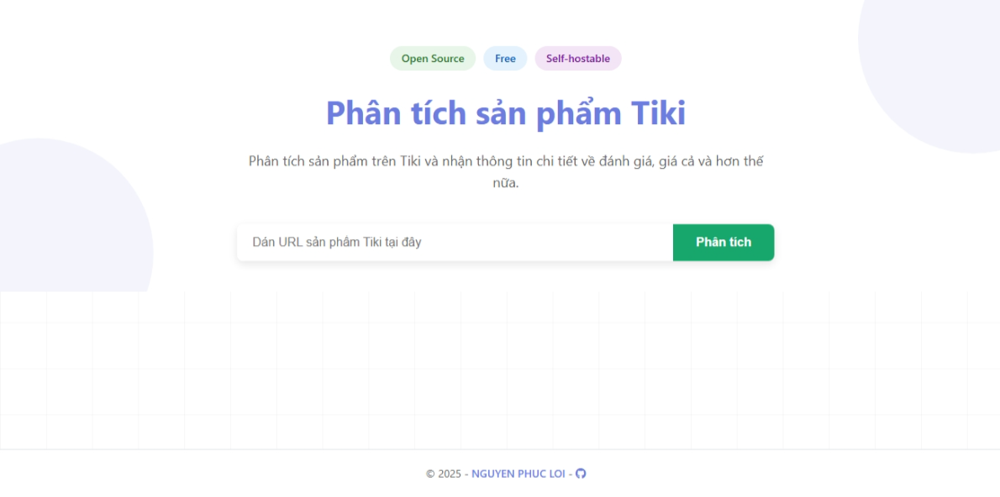
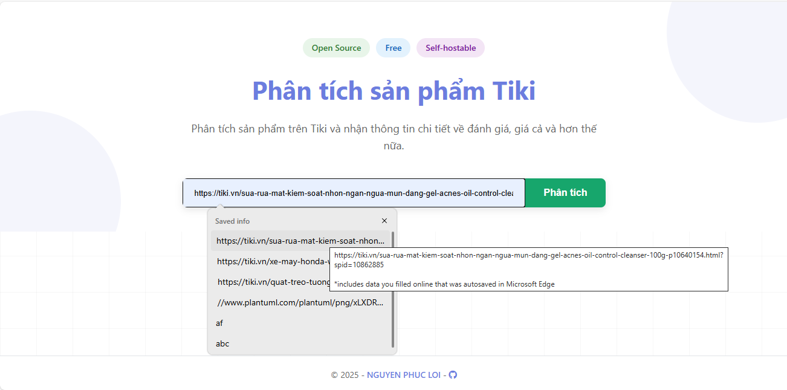
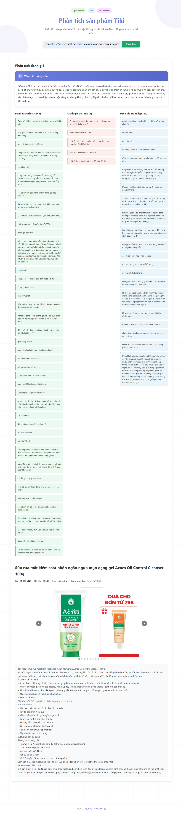

# Tiki Reviews
## Giới thiệu
Tiki Reviews là một ứng dụng web giúp người dùng phân tích sản phẩm trên nền tảng thương mại điện tử Tiki thông qua các liên kết (URL) sản phẩm. Ứng dụng sử dụng trí tuệ nhân tạo (AI) để đánh giá nhanh các bình luận, phân loại chúng thành tích cực, tiêu cực hoặc trung lập, hỗ trợ người dùng đưa ra quyết định mua hàng sáng suốt dựa trên cái nhìn khách quan.

## Hướng dẫn sử dụng giao diện
1. Trang chủ  

Có ô nhập "Điền URL sản phẩm Tiki tại đây" và nút "Phân tích" để bắt đầu.

2. Nhập URL và phân tích

Người dùng có thể nhập URL sản phẩm Tiki (ví dụ: kem rửa mặt, dầu gội) để phân tích.
Hình ảnh: 
Hiển thị ô nhập URL với ví dụ thực tế như https://tiki.vn/sua-rua-mat-kem-soat-nhon-ngan-ngua-mun-dang-gel-acnes-oil-control-cleanser-100g-p10640154.html.

3. Kết quả phân tích 

Sau khi phân tích, ứng dụng sẽ hiển thị thông tin chi tiết về sản phẩm, bao gồm các bình luận và phân loại cảm xúc.

Cảm ơn bạn đã quan tâm đến Tiki Reviews!